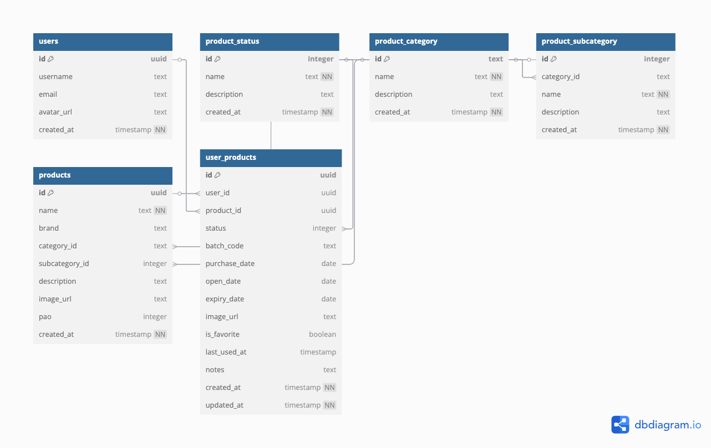

# VanityMate - 智能美妆管理助手

VanityMate 是一款专为美妆爱好者设计的智能管理应用。它帮助用户轻松管理所有美妆产品，追踪使用期限，并提供智能分类和管理功能。

## 主要功能

- 🎨 **智能分类管理**
  - 彩妆、护肤、香水、工具等多种分类
  - 直观的网格布局展示
  - 每个分类的产品数量统计

- 📱 **产品管理**
  - 产品详细信息记录
  - 保质期追踪
  - 使用状态管理（未开封/使用中/已用完）
  - 购入日期记录

- 🔍 **智能筛选**
  - 多维度排序（购入时间/过期时间/使用频率/价格）
  - 类型筛选
  - 状态标签过滤

- 💅 **用户友好界面**
  - 现代化 UI 设计
  - 流畅的动画效果
  - 直观的操作方式

## 技术栈

- React Native / Expo
- TypeScript
- Supabase (后端服务)
- TailwindCSS (样式管理)
- Expo Router (导航)

## 数据库设计

### ER 图


### 主要实体
- 用户 (Users)：存储用户基本信息
- 产品 (Products)：基础产品信息
- 用户产品 (User Products)：用户特定的产品使用信息
- 产品类别 (Product Categories)：产品分类信息
- 产品子类别 (Product Subcategories)：详细分类
- 产品状态 (Product Status)：产品使用状态

## 本地开发设置

### 前提条件

- Node.js (推荐 v18+)
- npm 或 yarn
- Expo CLI
- iOS 模拟器 (用于 iOS 开发)
- Android Studio (用于 Android 开发)

### 安装步骤

1. 克隆仓库

   ```bash
   git clone https://github.com/yourusername/vanitymate.git
   cd vanitymate
   ```

2. 安装依赖

   ```bash
   npm install
   # 或
   yarn install
   ```

3. 配置环境变量
创建 `.env` 文件并添加以下配置：

```bash
EXPO_PUBLIC_SUPABASE_URL=你的_SUPABASE_URL
EXPO_PUBLIC_SUPABASE_ANON_KEY=你的_SUPABASE_ANON_KEY
```

### Supabase 设置

1. 创建 Supabase 项目
   - 访问 [Supabase](https://supabase.com)
   - 创建新项目
   - 复制项目 URL 和 anon key

2. 数据库表结构设置
   - 在 `scripts/database.sql` 文件中包含了所有必要的数据库表结构
   - 将文件中的 SQL 语句复制到 Supabase SQL 编辑器中执行
   - 确保所有表都已成功创建并且没有错误

### 运行项目

1. 启动开发服务器

   ```bash
   npm start
   # 或
   yarn start
   ```

2. 选择运行平台
- 按 `i` 运行 iOS 模拟器
- 按 `a` 运行 Android 模拟器
- 按 `w` 运行 Web 版本

## 部署

本项目使用 Vercel 进行部署。确保在 Vercel 项目设置中添加必要的环境变量。

## 设计资源

设计文件位于 `scripts` 目录下：
- `product-list.html`: 产品列表页面设计
- 其他设计文件...

## 贡献

欢迎提交 Pull Requests 和 Issues。

## 许可证

[MIT License](LICENSE)
